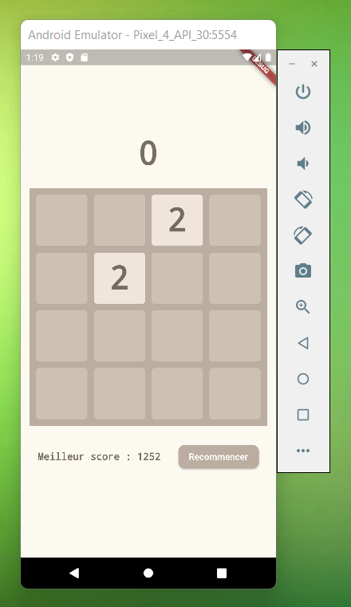
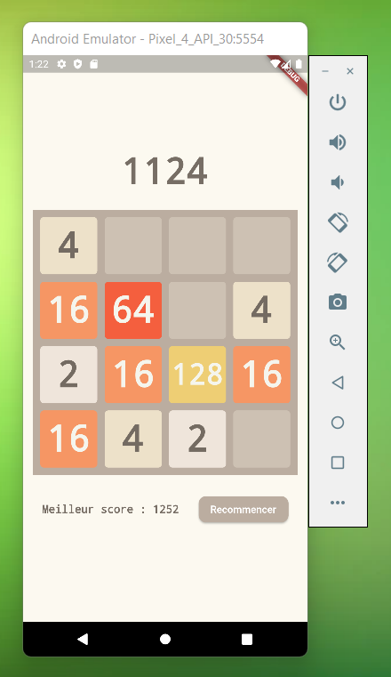
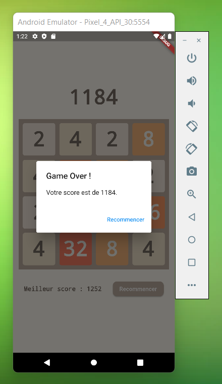

# 2048 Flutter App

## A propos

Ce projet a pour but de nous initier à la programmation Dart, le tout en créant une application mobile du jeu 2048 avec le framework Flutter.

Nous avons réalisé ce projet dans le cadre de notre formation de 5ème année d'ingénieur Informatique à l'INSA Hauts-de-France.

## Auteurs

- [Maxence ZOLNIERUCK](https://www.linkedin.com/in/maxence-zol/), apprenti développeur chez [Société Générale](https://www.societegenerale.com/fr).
- [Josué VIDREQUIN](https://www.linkedin.com/in/vidrequin-josu%C3%A9-1668bb170/) apprenti développeur chez [Renault MCA](https://www.renaultgroup.com/groupe/implantations/usine-maubeuge-mca/).

*Information à date de septembre 2022, ces dernières sont évolutives.*

## Prérequis


Pour lancer le projet, il vous faudra installer Flutter sur votre machine. Pour cela, vous pouvez suivre le tutoriel disponible sur le site officiel de Flutter : [https://flutter.dev/docs/get-started/install](https://flutter.dev/docs/get-started/install)

---


Pour lancer l'émulateur Android, il vous faudra installer Android Studio sur votre machine. Pour cela, vous pouvez suivre le tutoriel disponible sur le site officiel d'Android Studio : [https://developer.android.com/studio/install](https://developer.android.com/studio/install)

---


Pour lancer l'émulateur iOS, il vous faudra installer Xcode sur votre machine. Pour cela, vous pouvez suivre le tutoriel disponible sur le site officiel de Flutter : [https://flutter.dev/docs/get-started/install/macos#ios-setup](https://flutter.dev/docs/get-started/install/macos#ios-setup)

## Installation

Pour installer le projet, il vous suffit de cloner le dépôt Git :

```bash
git clone https://github.com/mxcezl/Flutter-2048.git
```

## Lancement

Pour lancer le projet, il vous suffit de lancer la commande suivante :

```bash
cd Flutter-2048
cd my_2048_app
flutter run
```

## Fonctionnalités

- [x] Génération d'une grille de 4x4
- [x] Génération de tuiles de valeur 2 ou 4 pour l'initialisation
- [x] Déplacement des tuiles
- [x] Fusion des tuiles
- [x] Génération d'une nouvelle tuile lors de la fusion
- [x] Détection de la fin de partie
- [x] Affichage du score
- [x] Affichage du meilleur score
- [x] Persistence du meilleur score
- [x] Affichage d'un pop-up lors de la fin de partie
- [x] Bouton de reset de partie
- [x] Couleurs différentes pour chaque valeur de tuile
- [x] Blocage des rotations du téléphone
- [x] Comparaison de la grille avant et après mouvement
- [x] Ajout d'une nouvelle tuile uniquement si changement de la grille

## Découpage du projet

Toutes les sources logiques du projet se trouvent dans le dossier `my_2048_app/lib`. Ce dossier contient les fichiers suivants :

- `main.dart` : fichier principal du projet, il contient le code de lancement de l'application.
- `constants.dart` : fichier contenant les constantes utilisées dans le projet.
- `tile_types.dart` : fichier contenant les méthodes liées aux types de tuiles utilisées dans le projet.
  - Listing des tuiles possibles
  - Génération d'une tuile aléatoire
  - Vérification de la valeur d'une tuile
- `tile.dart` : fichier contenant la classe `Tile` qui représente une tuile.
  - Stockage de la valeur de la tuile
  - Stockage de la couleur de la tuile
  - Stockage de la valeur à afficher sur la tuile
- `tile_manager.dart` : fichier contenant la classe `TileManager` qui gère les widgets liés aux tuiles.
  - Génération des widgets des tuiles
  - Génération de la grille initiale (2 tuiles avec valeur 2 ou 4 et le reste vide)
- `action_manager.dart` : fichier contenant la classe `ActionManager` qui gère les actions liées aux mouvements.
  - Déplacement des tuiles
  - Fusion des tuiles
  - Génération d'une nouvelle tuile lors de la fusion
  - Détéction de changement d'état de la grille
  - Ajout d'une tuile après un mouvement
  - Détection de la fin de partie
- `grid_moved_result.dart` : fichier contenant la classe `GridMovedResult` qui représente le résultat d'un mouvement.
  - Stocke l'état de la grille après le mouvement
  - Stocke le score généré par le mouvement
  - Stocke un booléen indiquant si la grille a changé
  - Stocke un booléen indiquant si la partie est terminée

## Screenshots

### Initial state



### Mid game



### End game



## Améliorations

- [ ] Ajout d'un bouton de retour en arrière
- [ ] Ajout d'un bouton de pause
- [ ] Création d'un menu
- [ ] Ajout d'un bouton de retour au menu
- [ ] Ajout d'un bouton de reset du meilleur score